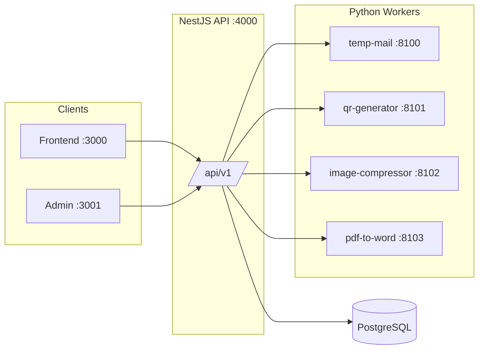

# Dev Hube — Developer Utility Hub (MB Stack)

Premium, full-stack platform for developer tools: disposable email, QR codes, image compression, PDF conversion, and a growing catalog of utilities. Built as a **monorepo** with a clear split between fast **Node.js APIs** and **Python workers** for heavy processing.

<p align="center">
  <strong>Frontend</strong> · <strong>Backend</strong> · <strong>Admin</strong> · <strong>Services</strong>
</p>

---

## Overview

| Layer | Stack | Port (dev) | Role |
|--------|--------|------------|------|
| **Frontend** | Next.js 15, React 19, Tailwind, Radix UI | `3000` | Public site, tool UIs, search, gallery |
| **Backend** | NestJS 11, TypeORM, PostgreSQL | `4000` | REST API ` /api/v1`, auth, persistence |
| **Admin** | Next.js, Redux | `3001` | Tool CRUD, settings, audit, admin auth |
| **Services** | FastAPI, Python 3.12+ | `8100–8103` | CPU-heavy jobs (images, PDF, QR, mail parsing) |



---

## Live tools (end-to-end)

| Tool | Route | API prefix | Python worker |
|------|--------|------------|----------------|
| Temp Mail | `/tools/temp-mail` | `/temp-mail` | `:8100` |
| QR Code Generator | `/tools/qr-generator` | `/qr-generator` | `:8101` |
| Image Compressor | `/tools/image-compressor` | `/image-compressor` | `:8102` |
| PDF to Word | `/tools/pdf-to-word` | `/pdf-to-word` | `:8103` |

Additional tools appear on the homepage as **Soon**; they share the same architecture pattern as they are implemented.

---

## Repository structure

```
Dev-Hube-Product-_-MB-Stack/
├── Frontend/                 # Public Next.js app
│   ├── src/app/              # App router (home, tools, blog)
│   ├── src/components/       # UI + per-tool components
│   └── src/lib/              # tools catalog, API clients
│
├── Backend/                  # NestJS API
│   ├── src/temp-mail/
│   ├── src/qr-generator/
│   ├── src/image-compressor/
│   ├── src/pdf-to-word/
│   ├── src/tools/            # Tools metadata API + seed
│   ├── src/auth/             # JWT + admin login
│   └── src/database/         # Migrations + seeds
│
├── Admin/                    # Internal dashboard
│   └── src/app/(dashboard)/  # Tools, settings, gallery
│
└── Services/                 # Python FastAPI workers
    ├── temp-mail/            # OTP parse, HTML sanitize
    ├── qr-generator/         # PNG QR + logo overlay
    ├── image-compressor/     # Pillow compress / WebP
    ├── pdf-to-word/          # pdf2docx conversion
    ├── image-compressor/run.bat
    ├── qr-generator/run.bat
    └── RUN-IMAGE-COMPRESSOR.bat
```

---

## Architecture principles

1. **Fast path (Node)** — Validation, auth, DB, routing, and small fallbacks stay in NestJS for low latency.
2. **Heavy path (Python)** — Image/PDF/QR generation and mail parsing run in isolated workers; the API proxies multipart/JSON and returns results.
3. **Stateless vs persisted** — Image compress and PDF convert are stateless; Temp Mail and QR (dynamic/tracked) use PostgreSQL (`temp_mailboxes`, `qr_codes`, `qr_scans`).
4. **Single API surface** — Frontend and Admin talk only to `NEXT_PUBLIC_API_URL` (default `http://localhost:4000/api/v1`).

---

## Prerequisites

- **Node.js** ≥ 20  
- **pnpm** ≥ 9  
- **PostgreSQL** (local or remote)  
- **Python** 3.12+ (recommended for workers; 3.14 supported where wheels exist)

---

## Quick start

### 1. Database

```bash
cd Backend
cp .env.example .env
# Edit DB_* credentials

pnpm install
pnpm run migration:run
pnpm run seed
```

### 2. Backend API

```bash
cd Backend
pnpm run build
pnpm start
# Dev with watch: pnpm run start:dev
```

API base: `http://localhost:4000/api/v1`  
Health: `http://localhost:4000/api/v1/health`

### 3. Python workers (one terminal per service)

| Service | Command |
|---------|---------|
| Temp Mail | `cd Services/temp-mail` → venv → `uvicorn main:app --host 127.0.0.1 --port 8100 --reload` |
| QR Generator | `Services/qr-generator/run.bat` or port **8101** |
| Image Compressor | `Services/RUN-IMAGE-COMPRESSOR.bat` or port **8102** |
| PDF to Word | `cd Services/pdf-to-word` → venv → `uvicorn main:app --host 127.0.0.1 --port 8103 --reload` |

Verify worker health, e.g. `http://127.0.0.1:8102/health` → `{"status":"ok","service":"image-compressor"}`.

> **Important:** Run each worker from its **own folder**. Starting uvicorn from the wrong directory (e.g. `qr-generator` on port 8102) causes `/compress` 404 while `/health` still returns 200.

### 4. Frontend

```bash
cd Frontend
cp .env.example .env
pnpm install
pnpm dev
```

Open: `http://localhost:3000`

### 5. Admin (optional)

```bash
cd Admin
cp .env.example .env
pnpm install
pnpm dev
```

Open: `http://localhost:3001` — default seed admin from `Backend/.env` (`ADMIN_EMAIL` / `ADMIN_PASSWORD`).

---

## Environment variables

### Backend (`Backend/.env`)

| Variable | Description |
|----------|-------------|
| `PORT` | API port (default `4000`) |
| `HTTP_BODY_LIMIT` | JSON body limit e.g. `2mb` (QR logos) |
| `DB_*` | PostgreSQL connection |
| `CORS_ORIGIN` | `http://localhost:3000,http://localhost:3001` |
| `JWT_SECRET` | Auth signing |
| `TEMP_MAIL_WORKER_URL` | `http://127.0.0.1:8100` |
| `QR_GENERATOR_WORKER_URL` | `http://127.0.0.1:8101` |
| `QR_GENERATOR_PUBLIC_API_URL` | Redirect base for dynamic QR |
| `IMAGE_COMPRESSOR_WORKER_URL` | `http://127.0.0.1:8102` |
| `PDF_TO_WORD_WORKER_URL` | `http://127.0.0.1:8103` |

### Frontend / Admin

| Variable | Description |
|----------|-------------|
| `NEXT_PUBLIC_API_URL` | `http://localhost:4000/api/v1` |
| `NEXT_PUBLIC_SITE_URL` | `http://localhost:3000` |

Copy from each package’s `.env.example`.

---

## Frontend highlights

- **Tool catalog** — `src/lib/tools.ts` (categories, SEO keywords, ready/soon status)
- **Tool pages** — `src/app/tools/[slug]/page.tsx` + dedicated components under `src/components/tools/`
- **Design** — Glass cards, page glow, circular gallery, Framer Motion, dark-first UI
- **API layer** — `src/lib/api.ts` + per-tool clients (`temp-mail-api`, `qr-generator-api`, etc.)

---

## Backend highlights

- Global prefix: `/api/v1`
- Modules: `TempMail`, `QrGenerator`, `ImageCompressor`, `PdfToWord`, `Tools`, `Auth`, `Settings`, `Audit`, `Admin`
- Uploads: in-memory multer for image/PDF (15–25 MB limits per tool)
- Migrations: TypeORM under `src/database/migrations/`

Useful scripts:

```bash
pnpm run build          # Required before pnpm start (prod-style)
pnpm run start:dev      # Watch mode
pnpm run db:setup       # migrate + seed
pnpm run check          # typecheck + lint
```

---

## Admin highlights

- JWT admin login against Backend
- Manage tools (slug, status, featured, metadata)
- Site settings and audit log views
- Runs on port **3001** to avoid clashing with Frontend

---

## Services (Python) highlights

| Worker | Key endpoints | Libraries |
|--------|----------------|-----------|
| temp-mail | `POST /parse/otp`, `POST /sanitize/html` | FastAPI, custom parsers |
| qr-generator | `POST /generate` | qrcode, Pillow |
| image-compressor | `POST /compress` | Pillow, WebP/JPEG/PNG |
| pdf-to-word | `POST /convert` | pdf2docx, PyMuPDF |

Each exposes `GET /health` with a `service` field for correct port checks.

---

## Port map (development)

| Port | Process |
|------|---------|
| 3000 | Frontend |
| 3001 | Admin |
| 4000 | NestJS Backend |
| 5432 | PostgreSQL |
| 8100 | temp-mail worker |
| 8101 | qr-generator worker |
| 8102 | image-compressor worker |
| 8103 | pdf-to-word worker |

---

## Tech stack summary

| Area | Technologies |
|------|----------------|
| Frontend | Next.js 15, React 19, TypeScript, Tailwind CSS, Radix UI, Framer Motion, Redux Toolkit, Fuse.js |
| Backend | NestJS 11, TypeORM, PostgreSQL, class-validator, JWT, Passport |
| Admin | Next.js, Redux Toolkit, Sonner |
| Workers | FastAPI, Uvicorn, Pillow, pdf2docx, qrcode |
| Tooling | pnpm workspaces-style packages, ESLint, Prettier |

---

## Troubleshooting

| Symptom | Likely cause | Fix |
|---------|----------------|-----|
| QR `500` / column errors | DB schema vs entity mismatch | `pnpm run migration:run`, rebuild backend |
| QR `413` | Logo too large for JSON limit | Set `HTTP_BODY_LIMIT=2mb`, rebuild |
| Image `503` / `Not Found` on compress | Wrong app on 8102 | Stop process; run `RUN-IMAGE-COMPRESSOR.bat` |
| Worker “healthy” but tool fails | QR on 8102 instead of image worker | Check `/health` → `service` field |
| Stale API after code change | Using `pnpm start` without build | `pnpm run build` then `pnpm start` |

---

## Roadmap

- End-to-end QA on all four live tools
- Implement next **Soon** tools (Merge PDF, Split PDF, AI utilities, etc.) using the same Node + Python pattern
- Production deployment (env hardening, worker process manager, CDN for static assets)

---

## License

Private project — All rights reserved unless otherwise specified by the repository owner.

---

<p align="center">
  <sub>Dev Hube · Built for developers who want fast tools and clean UX</sub>
</p>
